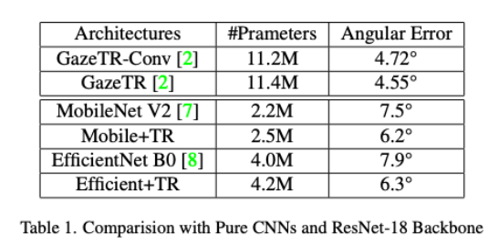

# GazeEstimation

This repository is inspired by the paper, [Gaze Estimation using Transformers](https://github.com/yihuacheng/GazeTR) proposed by Cheng et al. 
Please refer to the acknowledgement.

## Data
This project is utilized with the MPIIFaceGaze dataset. The MPIIFaceGaze dataset contains images of faces captured in everyday settings, which are used to train and evaluate the gaze estimation model.

For more information on the dataset, please refer to the [MPIIGaze dataset](https://perceptualui.org/research/datasets/MPIIFaceGaze/).

## Preprocessing

The preprocessing has been done using the code from: [Gazehub 3D-dataset](https://phi-ai.buaa.edu.cn/Gazehub/3D-dataset//#mpiigaze)

## Usage

Leave-one-person-out evaluation:

```
python trainer/leave.py -s config/train/config_mpii.yaml -p 0
```

Leave-one-person-out training:

```
python trainer/total.py -s config/train/config_mpii.yaml    

```

## Model performance


## References

1. Zhang, Xucong, Sugano, Yusuke, Fritz, Mario, and Bulling, Andreas. 
   "MPIIGaze: Real-World Dataset and Deep Appearance-Based Gaze Estimation." 
   *IEEE Transactions on Pattern Analysis and Machine Intelligence (TPAMI)*, 
   vol. 41, no. 1, pp. 162-175, 2019. 
   DOI: [10.1109/TPAMI.2017.2778103](https://doi.org/10.1109/TPAMI.2017.2778103).

2. Cheng, Yihua, and Lu, Feng. 
   "Gaze Estimation using Transformer." 
   *arXiv preprint*, 2021. 
   [arXiv:2105.14424](https://arxiv.org/abs/2105.14424).

3. Sandler, Mark, Howard, Andrew, Zhu, Menglong, Zhmoginov, Andrey, and Chen, Liang-Chieh. 
   "MobileNetV2: Inverted Residuals and Linear Bottlenecks." 
   *arXiv preprint*, 2019. 
   [arXiv:1801.04381](https://arxiv.org/abs/1801.04381).

4. Tan, Mingxing, and Le, Quoc V. 
   "EfficientNet: Rethinking Model Scaling for Convolutional Neural Networks." 
   *arXiv preprint*, 2020. 
   [arXiv:1905.11946](https://arxiv.org/abs/1905.11946).


## Acknowledgment
This project is based on and modifies code from the following repository:

- **[GazeTR](https://github.com/yihuacheng/GazeTR)** by Yihua Chen at Beihang University.

The original code is licensed under the [CC BY-NC-SA 4.0 license](https://creativecommons.org/licenses/by-nc-sa/4.0/), which allows sharing and adapting the material under certain conditions:
- **Attribution (BY)**: You must give appropriate credit, provide a link to the license, and indicate if changes were made.
- **Non-Commercial (NC)**: You may not use the material for commercial purposes.
- **Share-Alike (SA)**: If you remix, transform, or build upon the material, you must distribute your contributions under the same license.

### Modifications Made
- ResNet-18 CNN backbone was replaced by MobileNet V2 and EfficientNet B0

These modifications are shared under the same [CC BY-NC-SA 4.0 license](https://creativecommons.org/licenses/by-nc-sa/4.0/).
